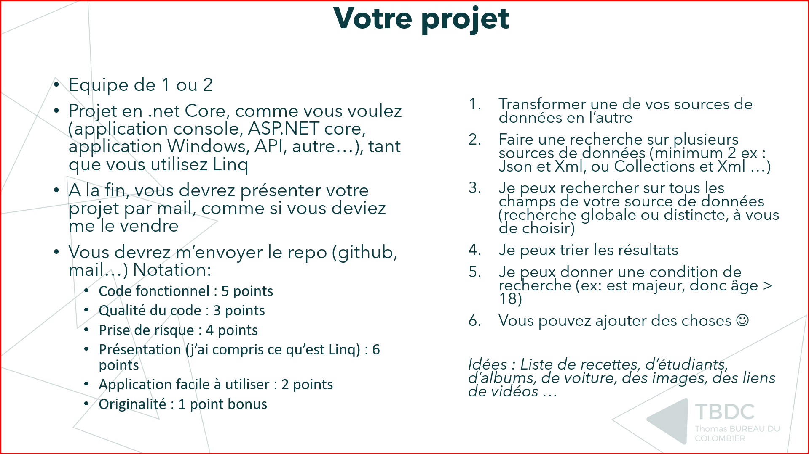

# ProjetLinqLoreneThomas

## Sujet

## Todo

- [x] Transformer une de vos sources de données en l'autre
- [x] Faire une recherche sur plusieurs sources de données (minimum 2 ex : Json et Xml, ou Collections et Xml ...)
- [x] Je peux rechercher sur tous les champs de votre source de données (recherche globale ou distincte, à vous de choisir)
- [x] Je peux trier les résultats
- [x] Je peux donner une condition de recherche (ex: est majeur, donc âge > 18)

## Utilisation

Lancer le `Program.cs`, il vous proposera plusieur scripts.
Vous avez le choix entre :
1. `Convertir un fichier Xml en Json` : Transforme une sources de données Xml en Json (Si vous voulez tester, vous pouvez utiliser les données du répertoire **data**).
2. `Convertir un fichier Json en Xml` : Transforme une sources de données Json en Xml (Si vous voulez tester, vous pouvez utiliser les données du répertoire **data**).
3. `Recherche un terme dans toutes les données` : Recherche dans toutes les données du répertoire **data**. Il vous demandera si vous voulez utiliser différents filtres et conditions pour la recherche des données.
4. `Recherche dans l'arbre des données` : Recherche dans l'arborescences des données de couche en couche suivant ce que vous séléctionnez.
0. `Quitter le programme` : Stop l'exécution du programme.
